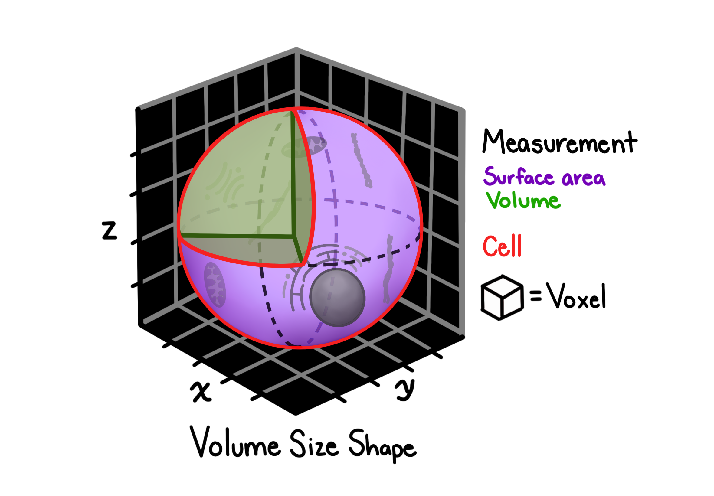

# Volume.size.shape

## Description

Volume.size.shape features characterize the geometric properties and spatial extent of segmented objects. these measurements are computed using both mesh and voxel-based approaches.

## Features extracted

### Volume.size.shape feature measurements

| Feature             | description                                      |
| ------------------- | ------------------------------------------------ |
| VOLUME              | total volume of the segmented object in voxels   |
| CENTER.X            | X-coordinate of object centroid                  |
| CENTER.Y            | Y-coordinate of object centroid                  |
| CENTER.Z            | Z-coordinate of object centroid                  |
| BBOX.VOLUME         | volume of the bounding box containing the object |
| MIN.X / MAX.X       | minimum and maximum X coordinates                |
| MIN.Y / MAX.Y       | minimum and maximum Y coordinates                |
| MIN.Z / MAX.Z       | minimum and maximum Z coordinates                |
| EXTENT              | ratio of object volume to bounding box volume    |
| EULER.NUMBER        | euler characteristic (topological descriptor)    |
| EQUIVALENT.DIAMETER | diameter of a sphere with equivalent volume      |
| SURFACE.AREA        | total surface area of the 3D object              |

## Calculation method

These features use 3D mesh reconstruction and voxel analysis:

1. **Mesh generation**: create 3D surface mesh from voxel boundaries
1. **Volume calculation**: sum voxels within segmented region
1. **Surface analysis**: compute surface area from mesh triangulation
1. **Spatial statistics**: calculate centroid and bounding box properties

## Applications

Volume.size.shape features are useful for:

- Quantifying cell and organoid growth
- Detecting morphological abnormalities
- Comparing size distributions across conditions
- Identifying fusion or fragmentation events
