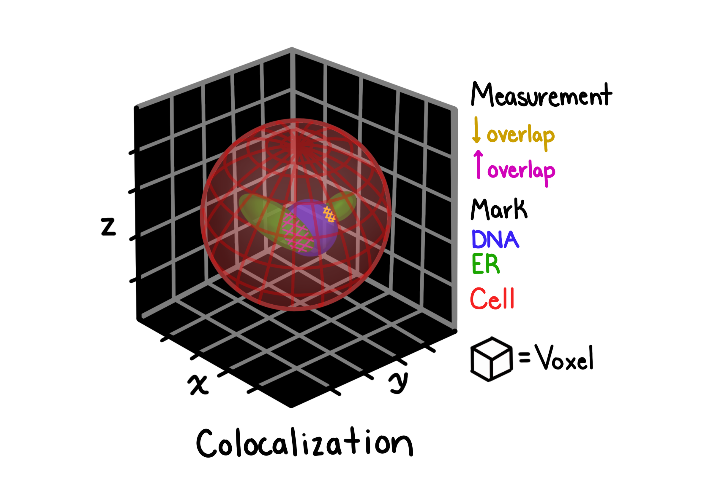

# Colocalization

## Description

Colocalization features quantify the degree to which two different spectral channels spatially co-occur within a segmented object. these measurements assess the relationship and correlation between different protein markers.

## Features extracted

### Correlation-based metrics

| Feature                  | description                            |
| ------------------------ | -------------------------------------- |
| MEAN.CORRELATION.COEFF   | mean pearson correlation coefficient   |
| MEDIAN.CORRELATION.COEFF | median pearson correlation coefficient |
| MIN.CORRELATION.COEFF    | minimum correlation coefficient        |
| MAX.CORRELATION.COEFF    | maximum correlation coefficient        |

### Manders coefficients (M1 and M2)

| Feature                  | description                                              |
| ------------------------ | -------------------------------------------------------- |
| MEAN.MANDERS.COEFF.M1    | average fraction of channel 1 overlapping with channel 2 |
| MEDIAN.MANDERS.COEFF.M1  | median M1 coefficient                                    |
| MIN/MAX.MANDERS.COEFF.M1 | min/max M1 values                                        |
| MEAN.MANDERS.COEFF.M2    | average fraction of channel 2 overlapping with channel 1 |
| MEDIAN.MANDERS.COEFF.M2  | median M2 coefficient                                    |
| MIN/MAX.MANDERS.COEFF.M2 | min/max M2 values                                        |

### Overlap coefficient

| Feature               | description                  |
| --------------------- | ---------------------------- |
| MEAN.OVERLAP.COEFF    | average overlap coefficient  |
| MEDIAN.OVERLAP.COEFF  | median overlap coefficient   |
| MIN/MAX.OVERLAP.COEFF | min/max overlap coefficients |

### K1 and K2 coefficients

| Feature    | description                                          |
| ---------- | ---------------------------------------------------- |
| MEAN.K1    | average intensity correlation quotient for channel 1 |
| MEDIAN.K1  | median K1 coefficient                                |
| MIN/MAX.K1 | min/max K1 values                                    |
| MEAN.K2    | average intensity correlation quotient for channel 2 |
| MEDIAN.K2  | median K2 coefficient                                |
| MIN/MAX.K2 | min/max K2 values                                    |

## Use cases

Colocalization features are useful for:

- Determining protein-protein interactions
- Assessing subcellular localization patterns
- Identifying co-distributed cellular components
- Quantifying marker overlap in immunofluorescence
