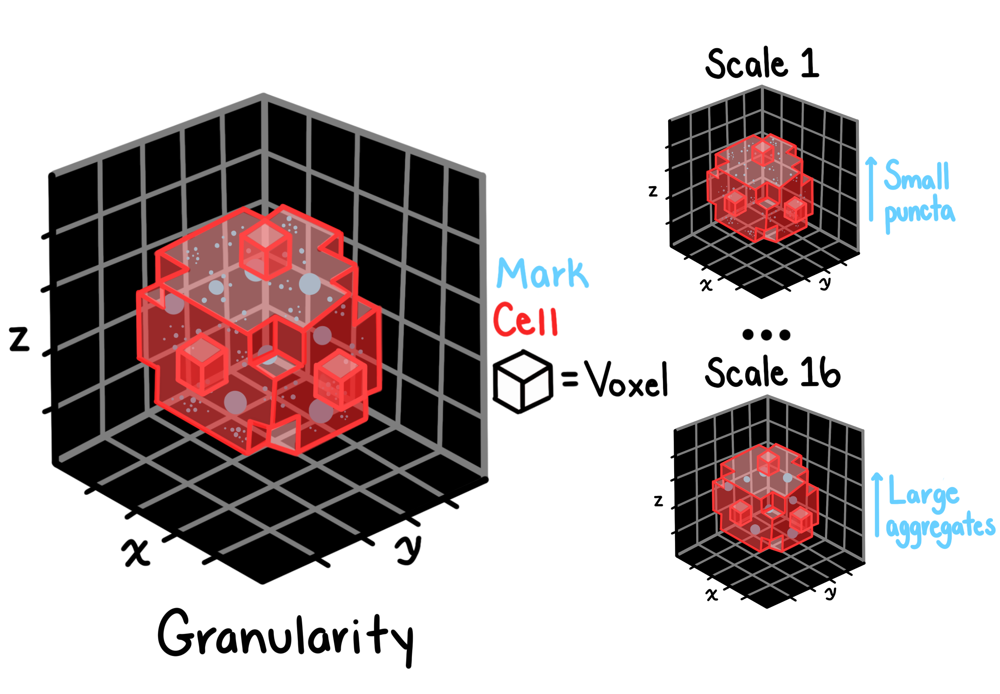

# Granularity features

## Description

Granularity features measure the size distribution of texture elements (granules) at multiple scales. these features reveal the characteristic scale of intensity variations within objects.

## Spectrum approach

Granularity is calculated across a spectrum of scales (1 to 16). in lay terms, granularity calculates how much of an image remains after "eroding" the image over multiple iterations or spectrum of scales. at each scale, the granularity value reflects the amount of texture detail present at that specific size. the feature's value can be read as the % of the original image signal retained at that scale.

## Features extracted

| Feature        | description                              |
| -------------- | ---------------------------------------- |
| GRANULARITY.1  | granularity at scale 1 (finest scale)    |
| GRANULARITY.2  | granularity at scale 2                   |
| ...            | ...                                      |
| GRANULARITY.16 | granularity at scale 16 (coarsest scale) |

## Interpretation

- **High granularity at small scales**: fine-grained texture details
- **High granularity at large scales**: coarse regional intensity variations
- **Granularity profile**: overall texture scale characteristics

### High granularity at small scales (1-3):

Indicates many small, punctate structures

Examples: individual vesicles, small mitochondria, RNA granules

### High granularity at medium scales (4-8):

Indicates larger organized structures

Examples: mitochondrial networks, endoplasmic reticulum sheets

### High granularity at large scales (9-16):

Indicates very coarse, chunky texture

Examples: large organelle aggregates, nuclear condensation

### Smooth profile (low across all scales):

Indicates uniform, homogeneous intensity

Examples: diffuse cytoplasmic proteins, uniform nuclear staining

### As an example, if a drug causes mitochondria to fragment, you'd see:

- Increased GRANULARITY.1-4 (more small pieces)
- Decreased GRANULARITY.8-12 (fewer large networks)

## Applications

Granularity features are useful for:

- Identifying cellular texture scale patterns
- Detecting subcellular compartment granularity
- Characterizing organelle size distributions
- Quantifying spatial heterogeneity
