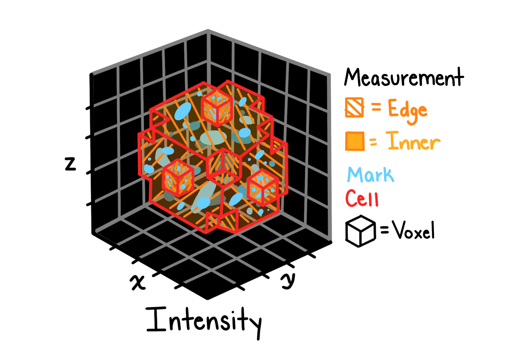

# Intensity

## Description

Intensity features quantify the pixel/voxel value distributions within segmented objects. these measurements capture both overall intensity levels and spatial intensity patterns.

## Features extracted

### Location-based intensity

| Feature               | description                                                      |
| --------------------- | ---------------------------------------------------------------- |
| CM.X / CM.Y / CM.Z    | average intensity-weighted coordinates in each spatial dimension |
| CMI.X / CMI.Y / CMI.Z | center of mass intensity in each spatial dimension               |
| I.X / I.Y / I.Z       | integrated intensity along each axis                             |
| MAX.X / MAX.Y / MAX.Z | coordinates of maximum intensity                                 |

### Statistical measures

| Feature                  | description                     |
| ------------------------ | ------------------------------- |
| MEAN.INTENSITY           | average intensity within object |
| MEDIAN.INTENSITY         | median intensity value          |
| MAX.INTENSITY            | maximum intensity value         |
| MIN.INTENSITY            | minimum intensity value         |
| STD.INTENSITY            | standard deviation of intensity |
| MAD.INTENSITY            | median absolute deviation       |
| LOWER.QUARTILE.INTENSITY | 25th percentile                 |
| UPPER.QUARTILE.INTENSITY | 75th percentile                 |

### Edge-based measurements

| Feature                   | description                            |
| ------------------------- | -------------------------------------- |
| INTEGRATED.INTENSITY.EDGE | sum of edge pixel intensities          |
| MEAN.INTENSITY.EDGE       | average edge intensity                 |
| MAX.INTENSITY.EDGE        | maximum edge intensity                 |
| MIN.INTENSITY.EDGE        | minimum edge intensity                 |
| STD.INTENSITY.EDGE        | standard deviation of edge intensities |
| EDGE.COUNT                | number of edge voxels                  |

### Other measurements

| Feature                  | description                                      |
| ------------------------ | ------------------------------------------------ |
| VOLUME                   | object volume (included for reference)           |
| DIFF.X / DIFF.Y / DIFF.Z | spatial intensity gradient in each dimension     |
| MASS.DISPLACEMENT        | distance between geometric and intensity centers |

## Calculation method

Intensity features are computed as follows:

1. **Segmentation masking**: apply object masks to isolate pixel/voxel values
1. **Statistical computation**: calculate mean, median, max, min, std, etc.
1. **Spatial analysis**: determine intensity-weighted coordinates and gradients
1. **Edge detection**: identify edge pixels/voxels and compute edge statistics

## Applications

Intensity features are useful for:

- Quantifying fluorescence levels within cellular structures
- Detecting changes in protein expression
- Characterizing subcellular localization patterns
- Identifying phenotypic alterations due to treatments
