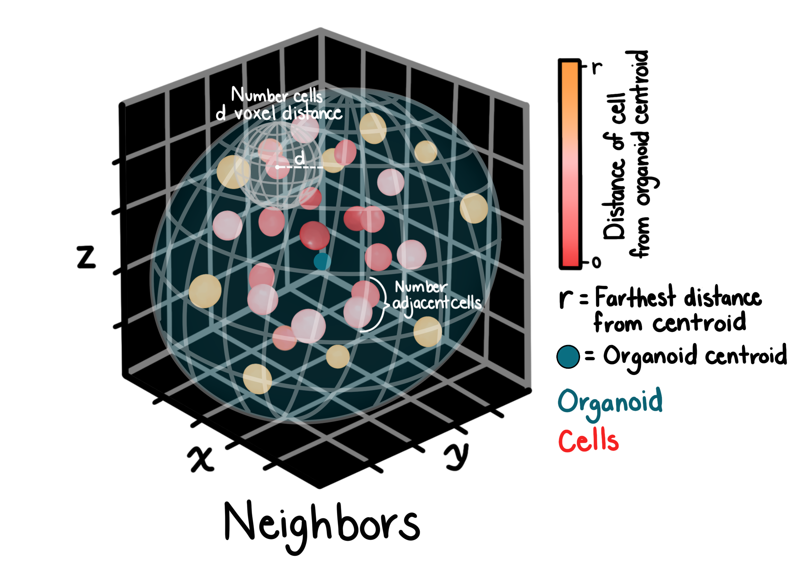

# Neighbors

## Description

Neighbors features quantify spatial relationships and adjacency patterns between segmented objects within the image volume.

## Current implementation

The neighbors feature set currently captures:

- Object-to-object proximity measurements
- Spatial adjacency statistics

## Total features

Currently **5 neighbors features** are extracted per image set.

## Applications

Neighbors features support analysis of:

- Tissue organization and architecture
- Cell-cell interactions
- Spatial clustering patterns
- Developmental organization
