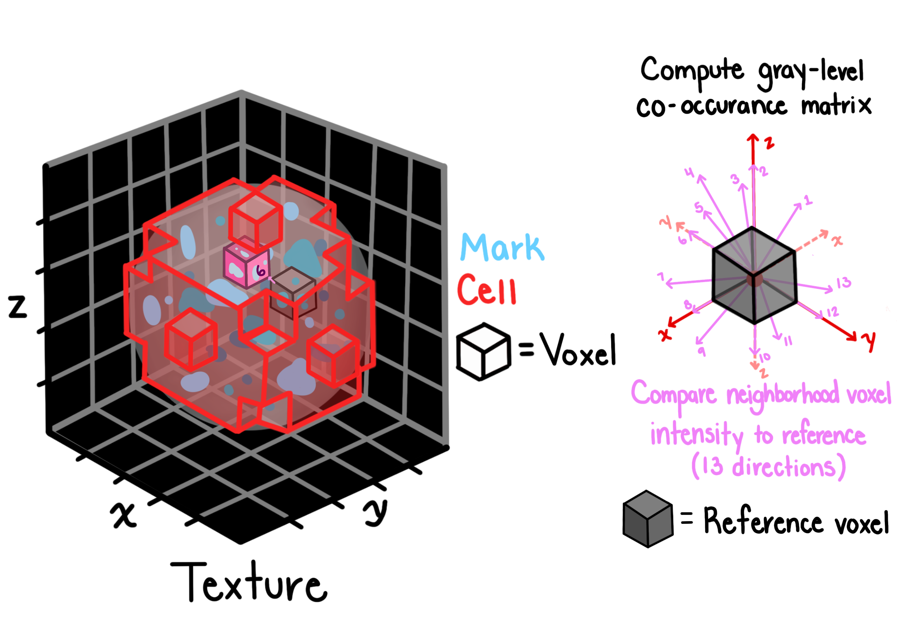

# Texture

## Description

Texture features quantify spatial patterns and local intensity variations within segmented objects. these features are computed from the gray-level co-occurrence matrix (GLCM).

## Calculation method

Texture features are derived from the gray-level co-occurrence matrix (GLCM), which captures the frequency of intensity pair relationships at specified offsets.

### Parameters

- **Gray levels**: 256 (quantization of intensity values)
- **Offset**: 1 voxel (distance for co-occurrence pairs)

These parameters can be adjusted to capture texture patterns at different scales.

## Features extracted

### Texture feature measurements

| Feature                   | description                                  | range            | low value indicates                                          | high value indicates                                               |
| ------------------------- | -------------------------------------------- | ---------------- | ------------------------------------------------------------ | ------------------------------------------------------------------ |
| Angular.second.moment     | textural uniformity / energy                 | [0, 1]           | heterogeneous, varied texture (many different patterns)      | uniform, homogeneous texture (repetitive patterns)                 |
| Contrast                  | local variation in intensity                 | \[0, ∞)          | smooth, low contrast (blurred edges, gradual transitions)    | sharp edges, high contrast (crisp boundaries, distinct structures) |
| Correlation               | linear dependency of neighboring gray levels | [-1, 1]          | uncorrelated, random texture (independent pixel intensities) | correlated texture (organized structures, smooth gradients)        |
| Variance                  | spread of GLCM intensity values              | [0, (255)²]      | narrow intensity range (uniform brightness)                  | wide intensity range (high dynamic range)                          |
| Inverse.difference.moment | local homogeneity                            | [0, 1]           | inhomogeneous (varied local intensities)                     | homogeneous (similar neighboring pixels)                           |
| Sum.average               | weighted mean intensity                      | [0, 2(255)]      | dark co-occurrence (low signal, dim staining)                | bright co-occurrence (strong signal, bright staining)              |
| Sum.variance              | variance of combined intensities             | \[0, ∞)          | consistent combined intensities                              | wide range of intensity sums                                       |
| Sum.entropy               | randomness in intensity sums                 | [0, log₂(511)]   | ordered, predictable sum patterns                            | random, disordered intensity sums                                  |
| Entropy                   | overall texture complexity                   | [0, log₂(65536)] | simple, ordered texture (smooth regions, uniform areas)      | complex, random texture (highly textured, irregular patterns)      |
| Difference.variance       | variance in intensity differences            | [0, (65536)]     | consistent contrast throughout                               | variable local contrast (mixed smooth/textured regions)            |
| Difference.entropy        | randomness in intensity differences          | [0, log₂(256)]   | smooth transitions (gradual edges)                           | irregular transitions (fragmented structures, noisy edges)         |
| Info.measure.corr.1       | mutual information correlation 1             | [-1, 1]          | weak correlation (think random noise)                        | strong nonlinear correlation (organized patterns)                  |
| Info.measure.corr.2       | mutual information correlation 2             | [0, 1]           | low mutual information (uncorrelated texture)                | high mutual information (highly organized texture)                 |

**Note:** 255 is used but can be replaced with ng where: ng represents the number of gray levels (256 in this implementation).
